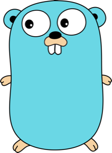
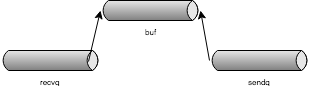

# Go in Depth

Dong Bin



---

# Standard Type
* Array
* Slice
* String
* Map
* Pointer
* Interface
* Channel

---
# Array
Fixed size sequential collection of elements
```go
var buffer [256]byte
intSet := [6]int{1, 2, 3, 5}
days := [...]string{"Sat", "Sun"} //len(days) == 2
```
---?image=assets/slice.png&size=auto 50%

Note:
Slice include a pointer, length and capacity
---
# Slice
Reference to a part of array
```go
type SliceHeader struct {
        Data uintptr
        Len  int
        Cap  int
}
  var s1 []int
  var s2 = make([]int, 10)
  var s3 = make([]int, 10, 20)
  fmt.Printf("len:%d, cap:%d\n", len(s1), cap(s1))
  fmt.Printf("len:%d, cap:%d\n", len(s2), cap(s2))
  fmt.Printf("len:%d, cap:%d\n", len(s3), cap(s3))
```
@[1-5]
@[6-11]

---

# Slice Append
```go
	array := [3]int{10,20,30}
	s := array[:]
	fmt.Printf("slice value: %v, array value: %v \n", s, array)
	s2 := append(s, 40)
	fmt.Printf("slice value: %v, array value: %v \n", s2, array)

	s = array[:2]
	fmt.Printf("slice value: %v, array value: %v \n", s, array)
	s2 = append(s, 40)
	fmt.Printf("slice value: %v, array value: %v \n", s2, array)
```
@[1-5](Append will create a new array and append value to the end)
@[7-10](Append will modify the existing array)

---
# String
```go
type StringHeader struct {
        Data uintptr
        Len  int
}
s := "hello world"
b := []byte(s)
s = string(b)
s = "你好"
fmt.Println(s[0]) //228
fmt.Println([]rune(s)[0]) //20320
fmt.Println(string([]rune(s)[0])) //你
```
@[1-4](Compare to slice, string has no cap)
@[5-7](Convertion between string and byte[])
@[8-11](Get a Unicode charactor from string)
Note:
String is immutable in GO. So conversion from byte to string and string concatenation need copy the whole byte[].
---
# Map
- Reference type
```go
var m map[string]int
m = make(map[string]int)
```
@[1](nil Map)
@[2](Initialized map)
- sync.Map|
```go
m := sync.Map{}
m.Store("x", 1)
x, _ := m.Load("x")
```
---
# Pointer
- Consider as C pointer
```go
x := 10
p := &x
var pp **int = &p
fmt.Printf("%d\n", **pp)
```
- Pass by pointer vs pass by value|
  - Pointer for big struct|
  - Pointer for modify|
---
# Memory allocation
```go
type MyType struct {
	Value string
}
func foo(){
	m := MyType{}
	fmt.Println(m.Value)
}
func foo2(){
	m := new(MyType)
	fmt.Println(m.Value)
}
```
@[1-7]
@[8-11]
@[](When possible, the Go compilers will allocate variables that are local to a function in that function's stack frame.)
---
# Escape Analysis
The basic rule is that if a reference to a variable is returned from the function where it is declared
```go
type S struct {M *int}
func foo(z S) S {return z}
func foo2(z *S) *S {return z}
func foo3(z S) *S {return &z}
func foo4(y int) S {return S{M: &y}}
func foo5(y *int) S {return S{M: y}}
```
@[1-2] foo declare no reference
@[3] foo2 declare no reference
@[4] foo3 declare &z and return, so called Escape
@[5] foo4 declare &y and &y is assigned to S and S returned, y must escape
@[6] foo5 declare no reference
---
## Interface is Duck typing
> if it looks like a duck and quacks like a duck, it’s a duck
```go
type Duck interface {
  Quack()
}
type Donald struct{}
func (d Donald) Quack(){
  fmt.Println("Quack quack!")
}
func sayQuack(duck Duck){
  duck.Quack()
}
func main() {
  donald := &Donald{}
  sayQuack(donald)
}
```
@[1-3]
@[4-7]
@[8-14]
Note: Interface contain pointer to Type and Value. Implicitly vs Explicitly, Cheap, Lazy abstraction

---
# Buildin Interface
```go
type error interface {
    Error() string
}
errors.New("Something goes wrong")
fmt.Errorf("Error occured while we have computed something: %v", err)
//io.Reader
type Reader interface {
        Read(p []byte) (n int, err error)
}
func ReadAll(r io.Reader) ([]byte, error)
r := strings.NewReader("Go is a general-purpose language designed with systems programming in mind.")
b, err := ioutil.ReadAll(r)
```
@[1-3]
@[4-5]
@[6-9]
@[10-12]
---
# Buildin Interface
```go
//sort.Interface
type Interface interface {
        Len() int
        Less(i, j int) bool
        Swap(i, j int)
}
type IntSlice []int
func (p IntSlice) Len() int           { return len(p) }
func (p IntSlice) Less(i, j int) bool { return p[i] < p[j] }
func (p IntSlice) Swap(i, j int)      { p[i], p[j] = p[j], p[i] }
s := []int{5, 2, 6, 3, 1, 4} // unsorted
sort.Sort(sort.Reverse(sort.IntSlice(s)))
```
@[1-6] Any collection can be sort if implement
@[7-10] Buildin type slice has implement it
@[11-12]
---
# Static Interface
```go
type Copyable interface {
	Copy() interface{}
}
func (v Value) Copy() Value {return v}
func returnsError() error {
  var p *MyError = nil
  return p
}
func main(){
  err := returnsError()
  if err != nil {
    fmt.Println("error found")
  }
}
```
@[1-4] Value and interface{} are different type, so no satisfy
@[5-14] error == nil only if error.Type == nil and error.Value == nil
---
# Channel
Message queue for communication
```go
func sumAll(s []int) int{
  c := make(chan int)  
  go sum(s[:len(s)/2], c)
  go sum(s[len(s)/2:], c)
  return <-c + <-c // receive from c
}
func sum(s []int, c chan int) {
	sum := 0
	for _, v := range s {
		sum += v
	}
	c <- sum // send sum to c
}
```
---
## Channel Implementation
```go
type hchan struct {
    qcount   uint           // 队列中数据个数
    dataqsiz uint           // channel 大小
    buf      unsafe.Pointer // 存放数据的环形数组
    elemsize uint16         // channel 中数据类型的大小
    closed   uint32         // 表示 channel 是否关闭
    elemtype *_type // 元素数据类型
    sendx    uint   // send 的数组索引
    recvx    uint   // recv 的数组索引
    recvq    waitq  // 由 recv 行为（也就是 <-ch）阻塞在 channel 上的 goroutine 队列
    sendq    waitq  // 由 send 行为 (也就是 ch<-) 阻塞在 channel 上的 goroutine 队列
    lock mutex
}
type waitq struct {
    first *sudog
    last  *sudog
}
```


---
# Q&A
