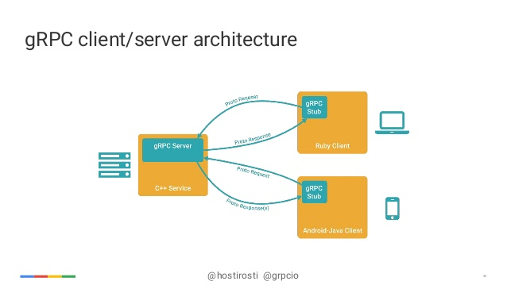

# Crm 2.0 Development Guide

Dong Bin


---
# GO code validation
- go vet - Reports potential errors that otherwise compile.
- go tool vet --shadow - Reports variables that may have been unintentionally shadowed.
- gotype - Syntactic and semantic analysis similar to the Go compiler.
- deadcode - Finds unused code.
- golint - Google's (mostly stylistic) linter.
- varcheck - Find unused global variables and constants.
- structcheck - Find unused struct fields.
- maligned - Detect structs that would take less memory if their fields were sorted.
- errcheck - Check that error return values are used.
- megacheck - Run staticcheck, gosimple and unused, sharing work.
- dupl - Reports potentially duplicated code.
- ineffassign - Detect when assignments to existing variables are not used.
- interfacer - Suggest narrower interfaces that can be used.
- unconvert - Detect redundant type conversions.
- goconst - Finds repeated strings that could be replaced by a constant.
- gas - Inspects source code for security problems by scanning the Go AST.
---
# Docker
- Medusa
  [Med](http://git.guazi-corp.com/medusa/med-sdk)
- Jenkins
  [Jekins](http://jenkins.guazi-cloud.com/jenkins/view/%E5%AE%A2%E6%9C%8D/
---
# Testing
- Go test
- Httptest
- Coverage
---
# Library
- Mysql
  - [go-orm](https://github.com/caojia/go-orm)
  - [squirrel](https://github.com/fluge/squirrel)
- redis|
```go
  type Cache interface {
	SAdd(key string, members ...interface{}) error
	SIsMember(key string, member interface{}) (bool, error)
	SMembers(key string) ([]string, error)
	Expire(key string, tm time.Duration) error
	GetOrSet(key string, val interface{}, timeout time.Duration, callback func() (interface{}, error)) error
	Get(key string, val interface{}) error
	Set(key string, val interface{}, timeout time.Duration) error
	SetNX(key string, val interface{}, timeout time.Duration) (bool, error)
	Del(key string) error
	Exists(key string) (bool, error)
```
---
# Structure
- Datasoup|
- Buslogic|
- Service|
---
# Protobuf
```Protobuf
/**
 * 创建任务服务
 */
service Creator {
    /// 创建任务接口
    rpc Create(AssignmentInfoRequest) returns (google.protobuf.Empty) {}

}

/**
 * 请求：任务信息
 */
message AssignmentInfoRequest {
    BusinessLine business_line = 1; /// 业务线
    Category category = 2;          /// 任务类型
    int32 source_id = 3;            /// 资源ID
}
```
---
# Grpc

---
# Grpc demo
```go
// Create 创建任务的接口
func (s *CreatorService) Create(ctx context.Context, assignmentInfoRequest *assignment.AssignmentInfoRequest) (*empty.Empty, error) {

	bl, err := buslogic.GetInstanceWithContext(ctx)
	if err != nil {
		return nil, status.Error(codes.Internal, "服务器内部错误[BusLogic]")
	}

	if err := ValidateParamsForAssignmentCreator(assignmentInfoRequest); err != nil {
		return nil, status.Error(codes.InvalidArgument, err.Error())
	}

	if err := bl.CreateAssignment(assignmentInfoRequest); err != nil {
		return nil, status.Error(codes.Internal, err.Error())
	}

	return &empty.Empty{}, nil
}
assignment.RegisterCreatorServer(grpcServer, &assignmentsrv.CreatorService{})
```
----
# Q&A
