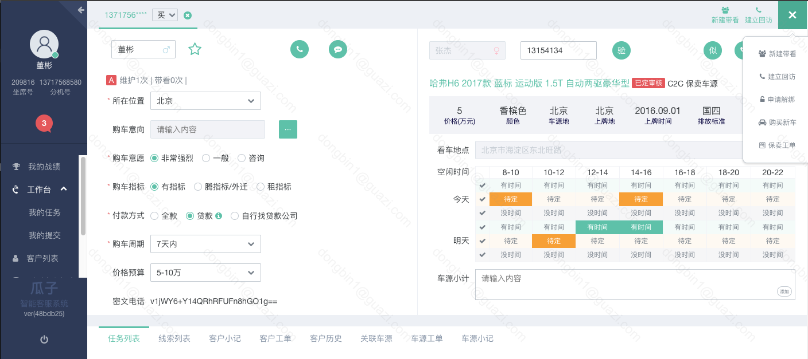
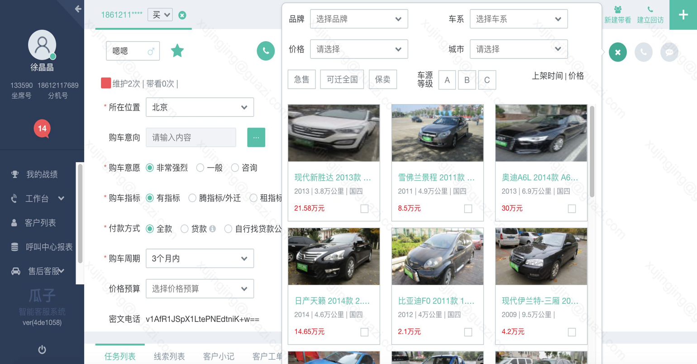
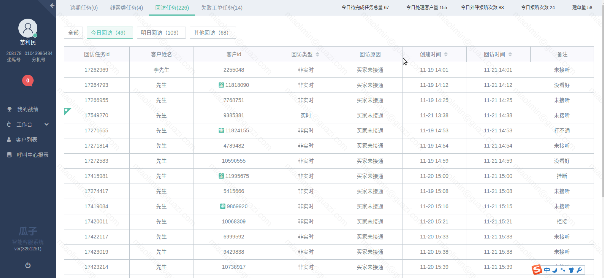

# Annual Report
## Dong Bin
---
## About Me
Architect of engineering, focus on:
- Lead tech design and decision
- Couch team members
- Review project development and implementation
- Build and improve tech infrastructure
---
## Background
- 2004 Graduate from Harbin Institute of Technology, Major of Computer Science
- 2004~2007 IBM CDL
- 2008~2011 Freewheel Inc.
- 2011-5~2015-2 Kabam Inc.
- 2015-3~2017-7 LinkedIn
- 2017-7-19~Now 瓜子
---
## Experience in Guazi
- July, join call center team. Training and discussions.
- August, deliver some tech improvements on existing system.
- Sep~Nov, work on CRM 2.0
---
## CRM 2.0 Background
- The existing CRM has lots of efficiency and design issues
- Each business department has built its own system, which is a waste
- The code and infrastructure was not design well for maintain and extensibility
---
## CRM 2.0 Objectives
- Simplify operation flow and optimize UI
- New features to enhance acquisition, e.g, car recommendation and star customer
- General platform for customer service and call center
- Ease to extend to another business
- Flexible for customization
- Fresh new tech stack for better efficiency and performance
---
## Achievement
- The end of Aug, CRM 2.0 kick off for sale department
- The end of Sep, core function delivered to QA
- Oct 17, new after-sale service center based on CRM 2.0 kick off
- Oct 21, first preview launch for sale
- Nov 20, full launch for sale
- Nov 21, preview launch for after-sale

---

---

---

---
## BI Log Pipeline Background
- Most of business log are collected in Mysql tables
- Painful to operate and query big data
- Lack of enough BI log

---
## New BI Log Pipeline
- Strict schema log
- Sink to Hadoop directly for easy query and operate
- Enhanced feature like realtime report and alerting
---
## Next Play at Finance
- Improve stability and robust
- Build new BI Data infrastructure
- Separate system into Micro-services

# Q&A
